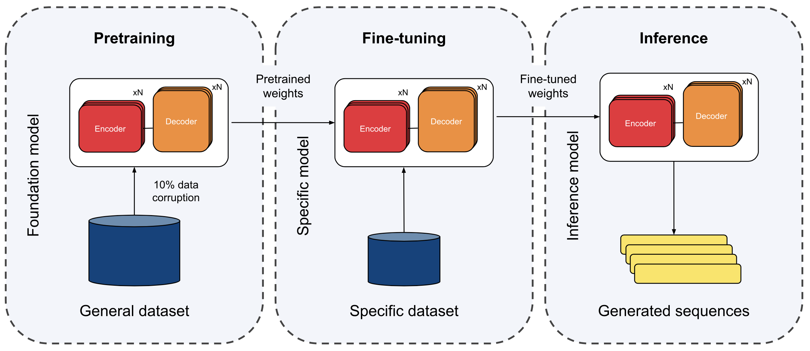

# Generating Novel Proteins with Biological Constraints Using Deep Conditional Language Modeling

This repository contains code and datasets related to my **Bachelor’s Thesis**, completed as part of the **Bachelor’s Degree in Bioinformatics (BDBI)** at **ESCI-UPF** in Barcelona, conducted at **Nostrum Biodiscovery** and awarded **Best Bachelor's Thesis of the 2022/2023 Course** 🏅. 

> 🔗 The full thesis can be accessed [here](http://hdl.handle.net/10230/59921).


## 🌟 Project Overview

This project focuses on **protein sequence generation** using deep learning models. Initially, two architectures were compared:

- **pGAN**: A self-attention-based GAN variant.
- **pLM**: A Transformer-based protein language model (pLM) pre-trained on evolutionary data.

Then, a **pLM** was pre-trained on a subset of the UniRef50 dataset using a masked language modeling (MLM) task. Fine-tuning on specific protein families, such as bacterial **MDH**, demonstrated that the model generates sequences that align with natural protein principles. We also explored adding **conditioning tags** to guide the generation process based on enzymatic reactions, although this provided minimal improvements.

<div align="center">
   
</div>

<sub>**General scheme of the transfer learning-based pretraining and fine-tuning approach.** This approach leverages knowledge and representations learned from a
large dataset to enhance performance on a specific task with a smaller, specific dataset. Initially, a neural network is trained by randomly initializing the weights and optimizing
them to minimize task-related errors. Upon achieving satisfactory training results, the network weights are saved. To train a new network for a different task and dataset,
instead of starting from random initialization, the saved weights from the previous network are used as the initial values. In this initialization process, the first network is the
pre-trained network, and the second network undergoes fine-tuning..</sub>


## ⚙️ Setup

### 🛠 Requirements

- Install the required dependencies from `requirements.yaml`:
   ```bash
   conda env create -f requirements.yaml
   ```

### 🗂 Repository Structure

- `configs/`: Configuration templates for both pGAN and pLM.
- `data/`: Sample datasets (in `.tar.gz` format) used in the experiments.
- `src/`: Source code for all the models, training, and inference scripts.

### 📊 Datasets

- Example datasets are available in the `data/` directory.
- You can use custom datasets for training, but they must be in TSV/CSV format and compressed into `.tar.gz`. Be sure to update the config file to specify the correct column index for the protein sequences.

## 🚀 Usage

### 1. Pretrain and Fine-tune pLM

1. Customize the pLM configuration in `configs/plm_config.yaml` (select pretraining/fine-tuning task, adjust dataset path, batch size, devices, etc.).
2. Log into your **Weights and Biases** account to track training runs:
   ```bash
   wandb login <your-API-key>
   ```
3. To pretrain or fine-tune the model:
   ```bash
   python src/plm/main.py
   ```
  
**Note**: For SLURM environments, add `srun` before the Python command to ensure proper parallel execution.


### 2. Generate Sequences with pLM

To generate protein sequences after training:
```bash
python src/plm/inference.py -n 100 -checkpoint data/checkpoints/model_weights.ckpt
```
Additional options include:
- `-k`: Beam size for beam search algorithm.
- `-num_tokens`: Number of tokens used in training (default is 29, may change if conditioning tags are used).

### 3. Train pGAN

1. Customize the pGAN configuration in `configs/pgan_config.yaml` (adjust dataset path, batch size, etc.).

2. To train the GAN model:
    ```bash
    python src/pgan/main.py
    ```

**Note**: The pGAN does not support multi-device training or the use of libraries such as DeepSpeed or Wandb. Training logs are saved locally, and loss curves are output as images.

## 📖 Extended Work and Publication

The work initiated in this project was extended at **Nostrum Biodiscovery** and contributed to the publication of *"Efficient and Accurate Sequence Generation with Small-Scale Protein Language Models."* This paper introduces a **Small-Scale Protein Language Model (SS-pLM)**, which significantly reduces computational requirements by using fewer parameters and a smaller dataset, while achieving performance comparable to larger models in protein sequence generation. Explore the full publication [here](https://doi.org/10.1101/2023.08.04.551626) 📘!

---

<div style="background-color: #f0f0f0; padding: 50px; border-radius: 10px; text-align: center;">
  <h3>Acknowledgments</h3>
   
   
</div>


